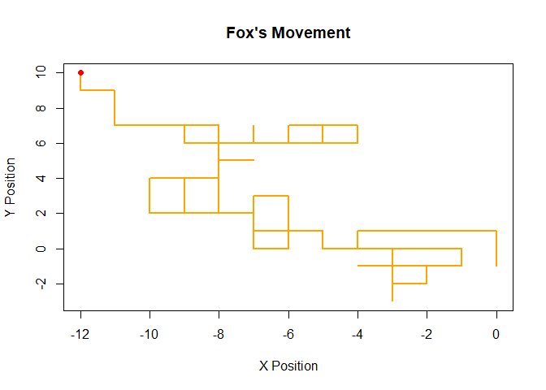

Fox trot
================

# Number of steps the fox will take

``` r
steps <- 100
```

# Initialize the fox’s starting position (x, y)

``` r
position <- c(x = 0, y = 0)
```

# Initialize vectors to store the fox’s path

``` r
x_positions <- numeric(steps)
y_positions <- numeric(steps)
```

# Random movement directions: North, East, South, West

``` r
directions <- list(
  north = c(0, 1),
  east  = c(1, 0),
  south = c(0, -1),
  west  = c(-1, 0)
)
```

# Function to simulate fox’s movement

``` r
move_fox <- function(position, directions) {
  direction <- sample(directions, 1)  # Randomly choose a direction
  position <- position + unlist(direction)
  return(position)
}
```

# Simulate the movement of the fox

``` r
for (i in 1:steps) {
  position <- move_fox(position, directions)
  x_positions[i] <- position[1]
  y_positions[i] <- position[2]
}
```

# Plot the path of the fox

``` r
plot(x_positions, y_positions, type = "l", col = "orange", lwd = 2,
     main = "Fox's Movement", xlab = "X Position", ylab = "Y Position")
points(x_positions[steps], y_positions[steps], col = "red", pch = 19)  # Final position
```

<!-- -->
